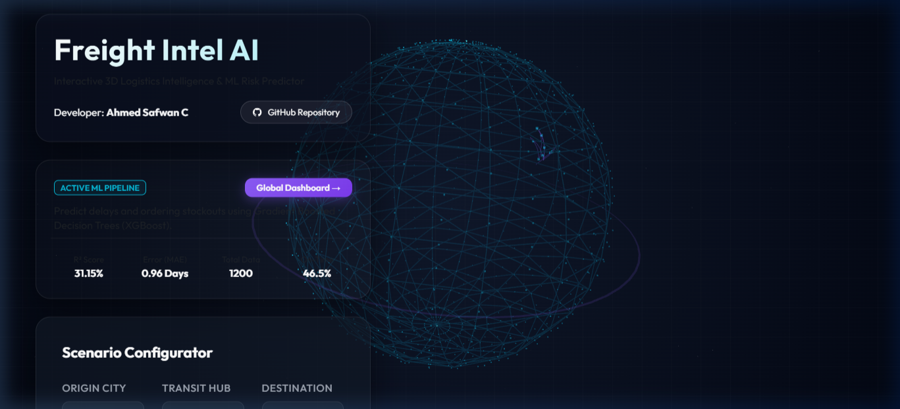
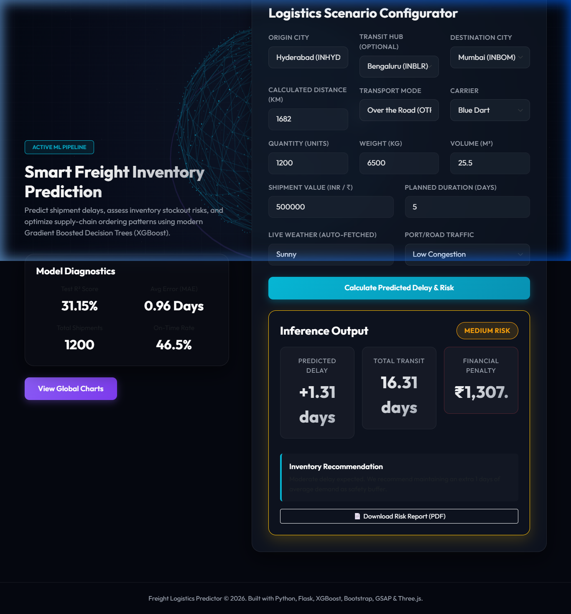
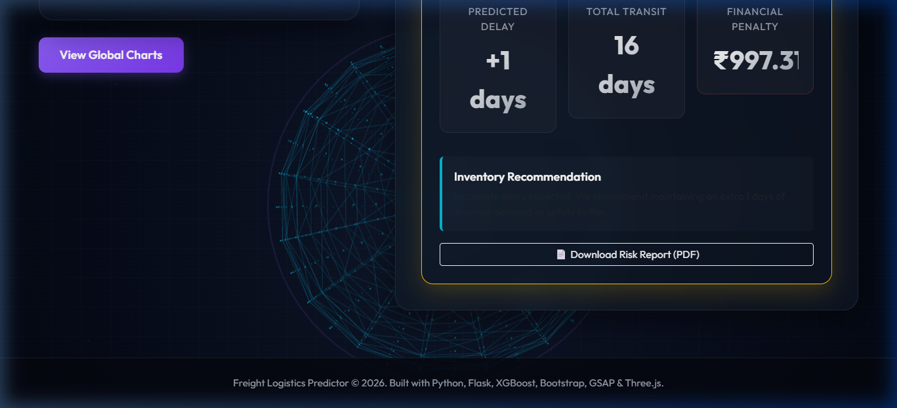

# Freight Intel AI 🌐✈️🚚

Freight Intel AI is a cutting-edge supply chain intelligence application designed to predict freight shipment delays, assess inventory stockout risks, and optimize ordering patterns using machine learning. The project features a stunning, interactive 3D WebGL holographic globe that visually maps route paths and transit hubs in real-time.

**Developed by:** [Ahmed Safwan C](https://github.com/safwan207)  
**GitHub Repository:** [Freight_Intel_AI](https://github.com/safwan207/Freight_Intel_AI)

---

## 🌟 Key Features

1. **Interactive 3D Supply Chain Globe (Three.js & OrbitControls)**:
   * A digital-hologram style interactive globe built with Three.js.
   * Full drag-to-rotate, pinch/scroll-to-zoom, and pan camera controls (via `OrbitControls`).
   * Dynamic real-time plotting of glowing logistics route curves (including transit hubs) animated by comet particles upon scenario calculation.

2. **Smart Freight Predictor (XGBoost ML Pipeline)**:
   * Predicts shipment transit duration, delays, and financial delay penalties.
   * Classifies delay risks (Low, Moderate, High) using a Gradient Boosted Decision Trees model.
   * Generates dynamic inventory suggestions (safety stock, order buffers) based on predictions.

3. **Live Weather Integration (Open-Meteo API)**:
   * Dynamically fetches current weather conditions at the destination coordinates in real-time.
   * Maps weather parameters directly into the ML inference pipeline.

4. **Multi-Mode Distance Matrix & Transit Hub Routing**:
   * Auto-calculates shipment distances across four modes (Air Cargo, Over the Road, Rail Intermodal, Ocean Freight) between major Indian cities: *Mumbai, Delhi, Chennai, Kolkata, Bengaluru, Hyderabad, Ahmedabad, and Kochi*.
   * Supports custom single-leg or dual-leg routes passing through a transit hub.

5. **Analytics Dashboard**:
   * Visualizes delay metrics by mode, carrier distributions, weather/traffic impact, and XGBoost feature importance.
   * **On-Demand Retraining**: Allows retraining the machine learning model on historical logs with a single click, regenerating charts and updating metrics dynamically.

6. **Recent Simulations Log (Raw Data Table)**:
   * Automatically persists prediction queries to a raw history log (`prediction_history.csv`) and displays recent simulation records in an interactive dashboard table.

7. **PDF Report Generator**:
   * Instantly converts prediction results, recommendation cards, and financial impact figures into a downloadable PDF report.

---

## 📸 Screenshots & Interface Walkthrough

### 1. Interactive Two-Column Landing Page
The landing page features a split-screen layout. The controls and ML diagnostics cards reside on the left with a premium glassmorphic theme, while the interactive 3D Globe spins freely on the right.


### 2. Route Calculation & Glowing 3D Comets
When you specify a route (e.g. Origin, Hub, and Destination) and click **Calculate**, the 3D globe immediately draws glowing, animated route arcs mapping the coordinates on the sphere.


### 3. Model Inference & Delay Risk Output
In seconds, the XGBoost engine calculates the risk tier, delay margin, financial impact penalty, and provides a custom inventory recommendation.


---

## 🛠️ Tech Stack

* **Backend Core**: Python 3, Flask (Web Server)
* **Machine Learning**: XGBoost, Scikit-learn, Pandas, Numpy, Joblib
* **Data Visualization**: Matplotlib, Seaborn
* **Frontend Web Stack**: HTML5, Vanilla CSS3 (Glassmorphism), Bootstrap 5, Three.js (WebGL), OrbitControls, GSAP (GreenSock Animation Platform), html2pdf.js

---

## 🚀 Getting Started

### Prerequisites
Make sure you have Python 3.9+ installed on your local machine.

### Installation
1. **Clone the repository**:
   ```bash
   git clone https://github.com/safwan207/Freight_Intel_AI.git
   cd Freight_Intel_AI
   ```

2. **Create a virtual environment** (recommended):
   ```bash
   python -m venv venv
   # On Windows:
   .\venv\Scripts\activate
   # On macOS/Linux:
   source venv/bin/activate
   ```

3. **Install dependencies**:
   ```bash
   pip install -r requirements.txt
   ```

4. **Train the XGBoost Model**:
   If the pre-trained weights are missing, generate them by running the pipeline script:
   ```bash
   python train_model.py
   ```

5. **Launch the Server**:
   ```bash
   python app.py
   ```

6. **Open in Browser**:
   Navigate to `http://127.0.0.1:5000/` in your web browser.

---

*Freight Intel AI © 2026. Designed and built with ❤️ by Ahmed Safwan C.*
